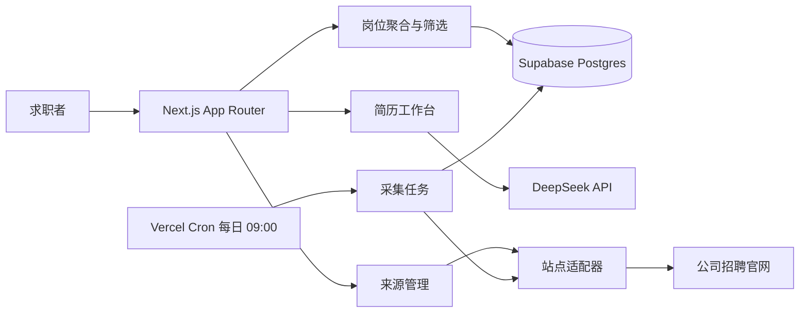

# ORBIT · 秋招 AI 求职中枢

ORBIT 是一个面向秋招求职者的 AI 求职工作台：把岗位发现、职位筛选、简历分析、招聘来源采集和求职行动管理放进同一条工作流里。

> 作品集演示：[orbit-job-assistant.vercel.app](https://orbit-job-assistant.vercel.app/)

## 产品亮点

- **银河式入口**：以求职时间轴为主线，把岗位、简历、来源和行动组织成可探索的工作空间。
- **岗位聚合与筛选**：聚合多家公司岗位，支持公司、城市、关键词、工作经验等条件筛选，并提供职位详情和官网入口。
- **来源采集**：支持登记公司招聘官网；静态页面走结构化解析，动态招聘站点走浏览器渲染采集，结果统一归一化到岗位列表。
- **每日自动刷新**：Vercel Cron 每天 09:00（Asia/Shanghai）触发采集任务，并把运行结果写入 Supabase，支持失败状态追踪。
- **简历工作台**：上传 PDF 简历，提取结构化经历与能力画像，生成面向目标岗位的改进建议。
- **求职行动管理**：通过工作区、申请追踪和日历记录从“发现岗位”到“投递复盘”的进度。
- **安全边界清晰**：浏览器端只使用 Supabase 公钥；服务端密钥、DeepSeek Key 和定时任务密钥不会暴露给客户端。

## 技术栈

| 层次 | 技术 |
| --- | --- |
| Web | Next.js 15 · App Router · React · TypeScript |
| UI | CSS Modules / 原生 CSS · 响应式布局 · 微软雅黑优先字体 |
| 数据 | Supabase Postgres · Supabase Auth · Row Level Security |
| AI | DeepSeek API · 结构化 JSON 输出 |
| 采集 | 原生 fetch · 站点适配器 · `@sparticuz/chromium` + Playwright |
| 部署 | Vercel · Serverless Functions · Vercel Cron |

## 系统架构



核心原则是“采集与展示解耦”：采集任务负责把不同官网的数据转换成统一岗位模型，前端只消费统一数据，因此增加新公司不会污染岗位列表页面。

## 快速开始

要求：Node.js 20+。

```bash
npm install
cp .env.example .env.local
npm run dev
```

然后打开 [http://localhost:3000](http://localhost:3000)。

### 环境变量

将 `.env.example` 复制为 `.env.local` 后填写：

| 变量 | 用途 | 暴露范围 |
| --- | --- | --- |
| `NEXT_PUBLIC_SUPABASE_URL` | Supabase 项目地址 | 浏览器可用 |
| `NEXT_PUBLIC_SUPABASE_PUBLISHABLE_KEY` | Supabase 公钥 | 浏览器可用 |
| `SUPABASE_SECRET_KEY` | 服务端管理操作 | 仅服务端 |
| `DEEPSEEK_API_KEY` | 简历/JD AI 分析 | 仅服务端 |
| `DEEPSEEK_MODEL` | 使用的 DeepSeek 模型 | 仅服务端 |
| `CRON_SECRET` | 保护定时采集接口 | 仅服务端 |

不要把 `.env.local`、真实 API Key、Supabase 密钥或个人简历上传到 Git 仓库。

## 常用脚本

```bash
npm run dev       # 启动开发服务器
npm run build     # 构建生产版本
npm run start     # 启动生产服务器
npx tsc --noEmit --incremental false  # TypeScript 检查
```

## 项目结构

```text
app/                         页面、布局和 API Routes
components/                  岗位列表、银河入口、导航和工作区组件
data/                        演示岗位数据
lib/job-schema.ts            统一岗位数据模型与校验
lib/source-adapters.ts       招聘官网适配器
lib/sources/task-runner.ts   采集任务编排、状态与错误处理
lib/supabase/                Auth、数据访问和 AI 分析服务
public/                      银河背景等静态资源
docs/                        架构、状态与后续路线图
vercel.json                  Cron 与 Chromium 构建配置
```

## 部署

项目适配 Vercel：

1. 在 Vercel 项目中配置 `.env.example` 中的生产环境变量。
2. 选择 Production 环境重新部署。
3. 在 Supabase 执行数据库迁移并确认 RLS 策略已启用。
4. Vercel Cron 使用 UTC `01:00`，对应北京时间每天 `09:00`。
5. 在 `/sources` 添加来源后，可在采集运行记录中查看成功、失败和岗位数量。

动态招聘官网可能受到登录、验证码、地区或反爬策略影响。生产环境应为每个站点维护独立适配器，并保留官网原始链接作为回退入口。

## 当前状态

这是一个已完成核心交互和公网演示的作品集项目，当前重点覆盖：岗位浏览、来源登记、每日采集编排、简历上传/解析工作流和求职行动管理。完整的产品状态、已知限制和下一阶段任务见：

- [系统架构](docs/ARCHITECTURE.md)
- [项目状态](docs/PROJECT_STATUS.md)
- [路线图](docs/ROADMAP.md)

## License

本项目用于个人作品集展示。未经许可，不建议直接复制其中的招聘站点采集配置或部署凭证。

